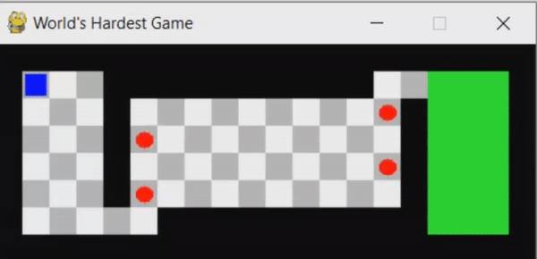
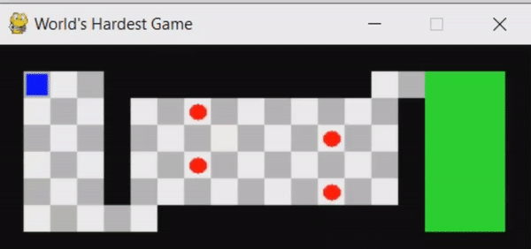

# Play and beat "World's Hardest game Using Artificial Intelligence"

## Abstract

The goal of this project is to use artificial intelligence algorithms to build and agent
that can play skill-based games. In this project we have chosen a simple obstacle avoiding
game called ["World's Hardest Game"]( https://www.crazygames.com/game/worlds-hardest-game ).

## Solution Approaches

### Genetic Algorithm

### Reinforcement Learning
